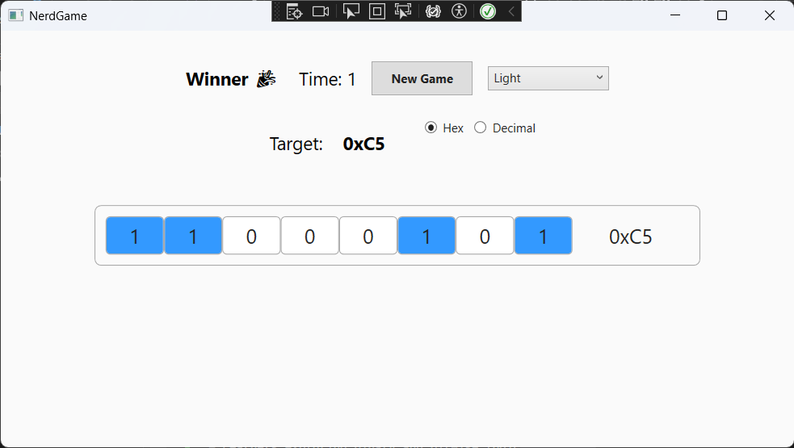
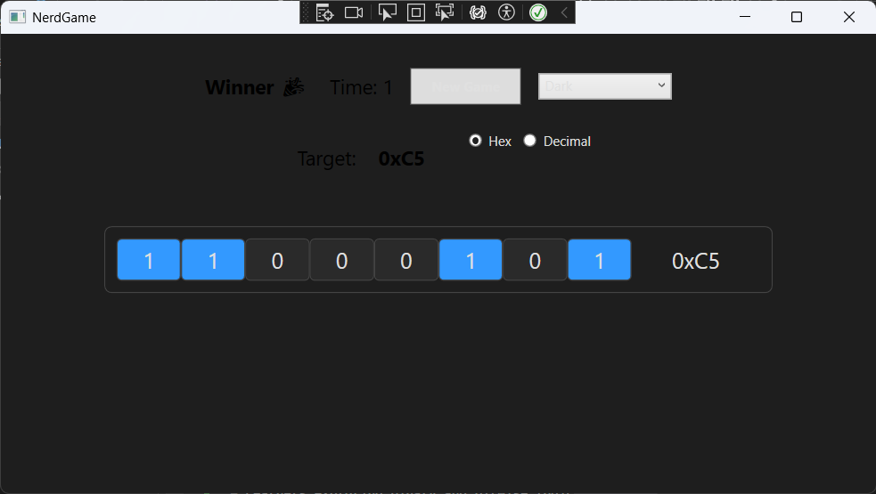

# 🧠 Nerd Game – A Binary Puzzle in WPF

**Nerd Game** is a clean, fast-paced desktop game built with WPF (.NET), where your goal is to toggle 8 bits to form a byte that matches a randomly generated target number. Whether you're in hex mode or decimal mode — you’ve only got 10 seconds to figure it out.



---

## 🎮 Features

- ✅ Toggle individual bits (0s and 1s) to form any byte (0–255)
- ✅ Match the target number displayed in **hex** or **decimal**
- ✅ Timer countdown: 10 seconds per round
- ✅ Responsive UI with real-time bit updates
- ✅ Themed UI with **Light** and **Dark** mode toggle
- ✅ Sound feedback and clear game result display (Win / Lose)

---

## 🖥️ Tech Stack

| Tool         | Usage                         |
|--------------|-------------------------------|
| .NET (WPF)   | UI and app framework           |
| XAML         | UI layout and theming          |
| C#           | Game logic, timer, event flow  |
| ResourceDictionaries | Theme switching (Light/Dark) |

---

## 🚀 Getting Started

### 🔧 Requirements
- .NET SDK 6.0+ or Visual Studio 2022+
- Windows OS (WPF is Windows-only)

### ▶️ Run the Game
```bash
git clone https://github.com/abhis-s/nerd-game.git
cd nerd-game
```
Open NerdGame.sln in Visual Studio and press F5 to run.

### 🧩 How to Play

1. Click **New Game**.
2. Check the target number (in hex or decimal).
3. Toggle the bit switches to match it.
4. Match the value before time runs out.

✔️ You win if the binary input matches the target.  
❌ You lose if the timer hits zero.

---

### 🌙 Theme Support

Choose between:
- 🌞 Light Mode
- 🌚 Dark Mode

Your UI updates instantly based on the selection in the theme dropdown.

---

### 📸 Screenshots

| Light Mode            | Dark Mode             |
|-----------------------|-----------------------|
|  |  |

---

### 🧠 Ideal For

- Learners exploring binary and bitwise logic
- C# WPF developers practicing modern UI design
- Puzzle lovers and quick thinkers

---

### 📄 License

MIT License — free to use, modify, and learn from.

---

### 💡 Future Ideas

- 🌟 Score tracking and high score board
- 🧠 Difficulty levels (e.g. reverse mode, time pressure)

---

Made with 💙 by [Abhishek S.](https://github.com/abhis-s)
